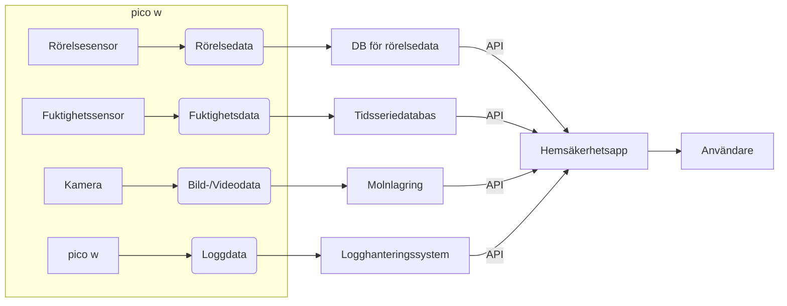

```mermaid

graph LR
    subgraph pico w
        A[Rörelsesensor] --> B(Rörelsedata)
        C[Fuktighetssensor] --> D(Fuktighetsdata)
        E[Kamera] --> F(Bild-/Videodata)
        G[pico w] --> H(Loggdata)
    end

    B --> I[DB för rörelsedata]
    D --> J[Tidsseriedatabas]
    F --> K[Molnlagring]
    H --> L[Logghanteringssystem]

    I -- API --> M[Hemsäkerhetsapp]
    J -- API --> M
    K -- API --> M
    L -- API --> M

    M --> N[Användare]
```
