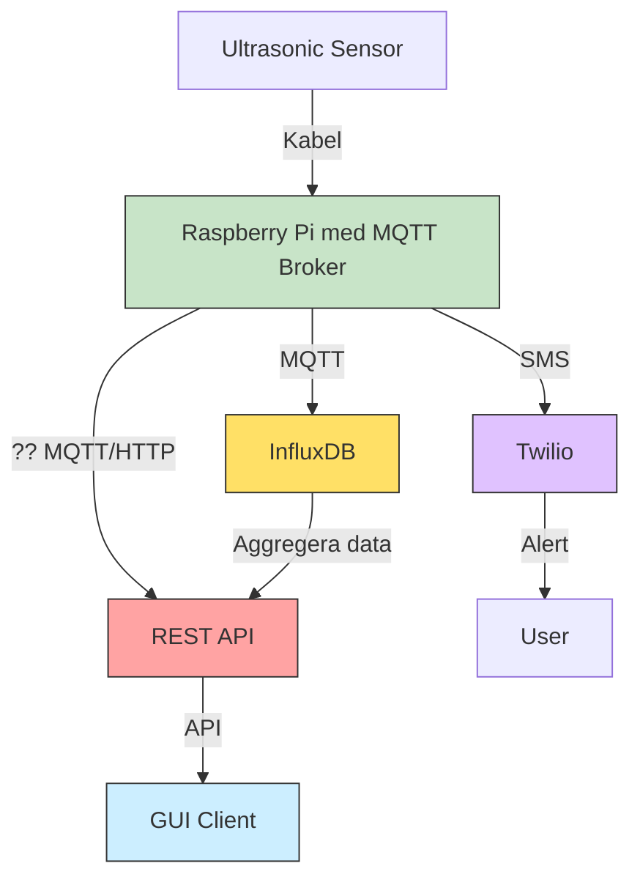

```mermaid

graph TD
    A[Ultrasonic Sensor] -->|Kabel| B[Raspberry Pi med MQTT Broker]
    B -->|MQTT| C[InfluxDB]
    B -->|?? MQTT/HTTP| D[REST API]
    C -->|Aggregera data| D
    D -->|API| E[GUI Client]
    B -->|SMS| F[Twilio]
    F -->|Alert| G[User]

    classDef db fill:#ffcc0099,stroke:#333
    classDef server fill:#ff666699,stroke:#333
    classDef gui fill:#66ccff55,stroke:#333
    classDef twilio fill:#cc99ff99,stroke:#333
    classDef mqtt fill:#99cc9988,stroke:#333

    class C db
    class D server
    class E gui
    class F twilio
    class B mqtt

```
